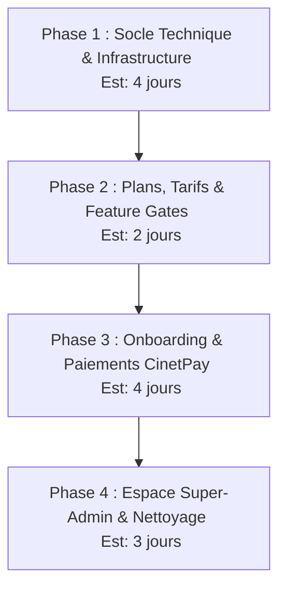

# Plan d'Implémentation : Transition SaaS Multi-Tenant (PostgreSQL Schémas)

Ce plan décrit les étapes pour transformer l'application de gestion de pâtisserie en une plateforme SaaS multi-tenant. Afin de structurer le travail, le chantier est divisé en **4 phases distinctes**.

---

## 1. Découpage du Projet en 4 Phases & Estimations



*   **Phase 1 (4 jours) :** Installation de `stancl/tenancy`, configuration d'Spatie Permission (mode Teams), réorganisation des migrations, configuration de l'isolation (DB/Cache/Fichiers/Queues), création du super-admin initial, et script de migration de l'historique (données, séquences et fichiers).
*   **Phase 2 (2 jours) :** Modélisation des offres, Enums des fonctionnalités, seeder de plans et développement des middleware/traits de restriction pour les composants Volt.
*   **Phase 3 (4 jours) :** Landing page globale, configuration des identifiants CinetPay, parcours d'onboarding en 3 étapes avec intégration de la passerelle Mobile Money et webhooks.
*   **Phase 4 (3 jours) :** Espace Super-Admin centralisé (métriques, suspension, impersonnalisation) et renommage de précaution des tables métiers du schéma `public` avant suppression.

---

## Phase 1 : Socle Technique & Infrastructure Multi-Tenant (Est : 4 jours)

L'objectif de cette phase est de rendre l'application "tenant-aware" sans casser le code existant.

### 1. Configuration des Dépendances & Connexions

> Ordre : exécuter composer install après l'étape 1.1, puis .env, puis configs.

#### 1.1 [composer.json](file:///home/zorin/Dev/pastry/composer.json)
Ajouter dans `require` :
```json
"stancl/tenancy": "^3.8"
```
Puis `composer update` (ou `composer require stancl/tenancy`).

#### 1.2 [.env](file:///home/zorin/Dev/pastry/.env) — Variables d'environnement
Ajouter :
```env
TENANCY_IDENTIFY_BY_SUBDOMAIN=true
SESSION_DOMAIN=.pastrysaas.com
```

#### 1.3 [config/database.php](file:///home/zorin/Dev/pastry/config/database.php)
Ajouter la connexion `tenant` dans le tableau `connections` :
```php
'tenant' => [
    'driver' => 'pgsql',
    'url' => env('DB_URL'),
    'host' => env('DB_HOST', '127.0.0.1'),
    'port' => env('DB_PORT', '5432'),
    'database' => env('DB_DATABASE', 'pastry'),
    'username' => env('DB_USERNAME', 'postgres'),
    'password' => env('DB_PASSWORD', ''),
    'charset' => 'utf8',
    'prefix' => '',
    'prefix_indexes' => true,
    'search_path' => 'public', // Surchargé dynamiquement par stancl/tenancy
    'sslmode' => 'prefer',
],
```

#### 1.4 [config/permission.php](file:///home/zorin/Dev/pastry/config/permission.php)
Passer `'teams' => true` (actuellement `false`). Laisser `'team_foreign_key' => 'team_id'` par défaut (correspond au `tenant_id`).

#### 1.5 [config/session.php](file:///home/zorin/Dev/pastry/config/session.php)
Modifier le domaine de session pour le partage entre sous-domaines :
```php
'domain' => env('SESSION_DOMAIN'),
```
> Le `.pastrysaas.com` (avec le point initial) permet au cookie session d'être valide sur `*.pastrysaas.com`.

#### 1.6 [config/tenancy.php](file:///home/zorin/Dev/pastry/config/tenancy.php) — NOUVEAU
Fichier de configuration principal. Généré par `php artisan tenancy:install` puis adapté :
```php
<?php

use Stancl\Tenancy\Database\Models\Domain;

return [
    'tenant_model' => App\Models\Tenant::class,
    'id_generator' => Stancl\Tenancy\UUIDGenerator::class,

    'bootstrappers' => [
        Stancl\Tenancy\Bootstrappers\DatabaseTenancyBootstrapper::class,
        Stancl\Tenancy\Bootstrappers\CacheTenancyBootstrapper::class,
        Stancl\Tenancy\Bootstrappers\FilesystemTenancyBootstrapper::class,
        Stancl\Tenancy\Bootstrappers\QueueTenancyBootstrapper::class,
    ],

    'features' => [
        Stancl\Tenancy\Features\TenantConfig::class,
        Stancl\Tenancy\Features\CrossDomainRedirect::class,
    ],

    'database' => [
        'central_connection' => 'pgsql',
        'template_tenant_connection' => 'tenant',
    ],

    'filesystem' => [
        'disks' => ['local', 'public'],
    ],

    'cache' => [
        'tag_based' => true, // isole le cache via des tags (Redis requis) ou préfixes
    ],

    'redis' => [
        'prefixed' => true, // préfixe toutes les clés Redis par le tenant
    ],

    'routes' => [
        'central_except' => [
            'onboarding.*',
            'webhooks.*',
            'super-admin.*',
        ],
    ],
];
```

#### 1.7 [app/Providers/TenancyServiceProvider.php](file:///home/zorin/Dev/pastry/app/Providers/TenancyServiceProvider.php) — NOUVEAU
```php
<?php

namespace App\Providers;

use Illuminate\Support\ServiceProvider;
use Stancl\Tenancy\Events\TenancyInitialized;
use Stancl\Tenancy\Events\TenancyEnded;
use Spatie\Permission\PermissionRegistrar;

class TenancyServiceProvider extends ServiceProvider
{
    public function register(): void
    {
        //
    }

    public function boot(): void
    {
        // Quand un tenant est initialisé, injecter son ID comme team Spatie
        \Event::listen(TenancyInitialized::class, function (TenancyInitialized $event) {
            app(PermissionRegistrar::class)->setPermissionsTeamId($event->tenancy->tenant->id);
        });

        // Quand le contexte tenant est libéré, réinitialiser
        \Event::listen(TenancyEnded::class, function () {
            app(PermissionRegistrar::class)->setPermissionsTeamId(null);
        });
    }
}
```

#### 1.8 [bootstrap/app.php](file:///home/zorin/Dev/pastry/bootstrap/app.php)
Ajouter le middleware de résolution de tenant **avant** les sessions :
```php
->withMiddleware(function (Middleware $middleware): void {
    $middleware->web(prepend: [
        \Stancl\Tenancy\Middleware\InitializeTenancyByDomainOrSubdomain::class,
    ]);
    // ... (conserver EnsureUserIsActive et Spatie)
});
```

---

### 2. Réorganisation des Migrations

> Ordre : déplacer les fichiers d'abord, puis créer les nouvelles migrations, puis lancer `php artisan migrate`.

#### 2.1 Déplacement des migrations métiers

```bash
# Créer le dossier cible
mkdir -p database/migrations/tenant

# Déplacer toutes les migrations métiers (celles qui finiront dans les schemas tenant)
git mv database/migrations/2026_06_07_143751_create_clients_table.php        database/migrations/tenant/
git mv database/migrations/2026_06_07_150045_create_orders_table.php          database/migrations/tenant/
git mv database/migrations/2026_06_09_003347_create_transactions_table.php    database/migrations/tenant/
git mv database/migrations/2026_06_10_000001_create_order_levels_table.php    database/migrations/tenant/
git mv database/migrations/2026_06_10_000002_create_order_status_logs_table.php database/migrations/tenant/
git mv database/migrations/2026_06_10_000003_create_order_images_table.php    database/migrations/tenant/
git mv database/migrations/2026_06_10_000004_create_suppliers_table.php       database/migrations/tenant/
git mv database/migrations/2026_06_10_000005_create_ingredients_table.php     database/migrations/tenant/
git mv database/migrations/2026_06_10_000006_create_inventory_movements_table.php database/migrations/tenant/
git mv database/migrations/2026_06_10_000007_create_delivery_partners_table.php   database/migrations/tenant/
git mv database/migrations/2026_06_10_000008_create_recipes_table.php         database/migrations/tenant/
git mv database/migrations/2026_06_10_000009_create_recipe_ingredients_table.php  database/migrations/tenant/
git mv database/migrations/2026_06_10_000011_migrate_order_statuses.php       database/migrations/tenant/
git mv database/migrations/2026_06_13_203713_create_settings_table.php        database/migrations/tenant/
git mv database/migrations/2026_06_13_211526_create_whatsapp_templates_table.php  database/migrations/tenant/
git mv database/migrations/2026_06_13_220001_create_experiences_table.php     database/migrations/tenant/
git mv database/migrations/2026_06_20_185812_add_setup_token_to_users_table.php  database/migrations/tenant/
git mv database/migrations/2026_06_20_194927_add_setup_token_sent_at_to_users_table.php database/migrations/tenant/
# Laisser dans database/migrations/ :
#   - 0001_01_01_000000_create_users_table.php     (MODIFIÉ pour public.users)
#   - 0001_01_01_000001_create_cache_table.php     (GLOBAL)
#   - 0001_01_01_000002_create_jobs_table.php      (GLOBAL)
#   - 2024_01_01_000000_create_passkeys_table.php  (À DÉPLACER aussi — tenant)
#   - 2025_08_14_170933_add_two_factor_columns_to_users_table.php (À DÉPLACER — tenant)
#   - 2026_06_06_230610_create_permission_tables.php (À DÉPLACER — tenant, Spatie par schema)
#   - 2026_06_13_203329_create_notifications_table.php  (À DÉPLACER — tenant)
#   - 2026_06_13_205215_add_indexes_for_performance.php (À DÉPLACER — tenant)
```

#### 2.2 Migration `create_tenants_table.php` — NOUVELLE (dans `database/migrations/`)
```php
Schema::create('tenants', function (Blueprint $table) {
    $table->id();
    $table->string('name');
    $table->string('slug')->unique();           // sous-domaine
    $table->string('schema_name')->unique();     // tenant_1, tenant_2...
    $table->foreignId('plan_id')->nullable()->constrained()->nullOnDelete();
    $table->string('status')->default('trial');  // trial, active, suspended, expired
    $table->timestamp('trial_ends_at')->nullable();
    $table->timestamp('subscription_ends_at')->nullable();
    $table->jsonb('preferences')->nullable();
    $table->timestamps();
});
```

#### 2.3 Migration `create_domains_table.php` — NOUVELLE (dans `database/migrations/`)
```php
Schema::create('domains', function (Blueprint $table) {
    $table->id();
    $table->foreignId('tenant_id')->constrained()->cascadeOnDelete();
    $table->string('domain')->unique();
    $table->boolean('is_primary')->default(false);
    $table->timestamps();
});
```

#### 2.4 Modification de `public.users` — Migration dédiée (dans `database/migrations/`)
Nouvelle migration `xxxx_xx_xx_add_is_super_admin_to_users_table.php` :
```php
Schema::table('users', function (Blueprint $table) {
    $table->boolean('is_super_admin')->default(false)->after('is_active');
});
```

#### 2.5 Migration des tables `passkeys`, `notifications`, `two_factor`, `permissions` — dans `tenant/`
Ces tables étaient dans `public` et doivent être déplacées dans chaque schema tenant. Le déplacement des migrations dans `database/migrations/tenant/` suffit : elles s'exécuteront dans chaque schema à la création du tenant.

---

### 3. Isolation du Système (Cache, Fichiers & Queues)

> Ordre : la config est déjà faite dans `config/tenancy.php` (étape 1.6). Vérifier les dépendances.

#### 3.1 Cache
- `CacheTenancyBootstrapper` déjà activé (étape 1.6)
- Si utilisation du cache fichier (`file`), le préfixe est automatique
- Si Redis, vérifier que `config/tenancy.php` a `'redis' => ['prefixed' => true]`

#### 3.2 Stockage
- `FilesystemTenancyBootstrapper` activé avec `'disks' => ['local', 'public']`
- Conséquence : `storage/app/public/` devient `storage/app/public/tenant_N/` automatiquement
- **⚠️ Attention :** La migration historique (étape 4) doit désactiver temporairement ce bootstrapper pour déplacer les fichiers existants

#### 3.3 Queues / Horizon
- `QueueTenancyBootstrapper` activé
- Garantit que les jobs conservent le contexte tenant (sérialisation du `tenant_id` dans le payload)
- Horizon config existante : vérifier que `config/horizon.php` utilise la connexion `tenant` pour les workers

#### 3.4 [config/horizon.php](file:///home/zorin/Dev/pastry/config/horizon.php) — VÉRIFICATION
S'assurer que la connexion de queue par défaut utilise le même redis :
```php
'defaults' => [
    'supervisor-1' => [
        'connection' => 'redis',
        'queue' => ['default'],
        'balance' => 'auto',
        'processes' => 3,
        'tries' => 3,
    ],
],
```
> Aucun changement requis si Redis est déjà configuré.

---

### 4. Modèle Tenant

> Ordre : après les migrations globales.

#### 4.1 [app/Models/Tenant.php](file:///home/zorin/Dev/pastry/app/Models/Tenant.php) — NOUVEAU
```php
<?php

namespace App\Models;

use Stancl\Tenancy\Database\Models\Tenant as BaseTenant;
use Stancl\Tenancy\Contracts\TenantWithDatabase;
use Stancl\Tenancy\Database\Concerns\HasDatabase;
use Stancl\Tenancy\Database\Concerns\HasDomains;

class Tenant extends BaseTenant implements TenantWithDatabase
{
    use HasDatabase, HasDomains;

    protected $fillable = [
        'name', 'slug', 'schema_name', 'plan_id',
        'status', 'trial_ends_at', 'subscription_ends_at', 'preferences',
    ];

    protected function casts(): array
    {
        return [
            'trial_ends_at' => 'datetime',
            'subscription_ends_at' => 'datetime',
            'preferences' => 'json',
        ];
    }

    public function plan()
    {
        return $this->belongsTo(Plan::class); // Plan sera créé en Phase 2
    }

    public function domains()
    {
        return $this->hasMany(Domain::class);
    }

    public function subscriptions()
    {
        return $this->hasMany(Subscription::class); // Subscription sera créé en Phase 2
    }
}
```

#### 4.2 [app/Models/Domain.php](file:///home/zorin/Dev/pastry/app/Models/Domain.php) — NOUVEAU
```php
<?php

namespace App\Models;

use Stancl\Tenancy\Database\Models\Domain as BaseDomain;

class Domain extends BaseDomain
{
    protected $fillable = ['domain', 'tenant_id', 'is_primary'];
}
```

---

### 5. Commande de Migration Historique (`public` ➔ `tenant_1`)

> Ordre : après tout le reste de la Phase 1. Dernière étape avant validation.

#### 5.1 [app/Console/Commands/MigrateExistingDataToTenant.php](file:///home/zorin/Dev/pastry/app/Console/Commands/MigrateExistingDataToTenant.php) — NOUVEAU

```php
<?php

namespace App\Console\Commands;

use App\Models\Tenant;
use Illuminate\Console\Command;
use Illuminate\Support\Facades\Artisan;
use Illuminate\Support\Facades\DB;
use Illuminate\Support\Facades\Storage;
use Stancl\Tenancy\Database\Models\Domain;

class MigrateExistingDataToTenant extends Command
{
    protected $signature = 'tenant:migrate-existing-data';
    protected $description = 'Migre les données du schema public vers le premier tenant (tenant_1)';

    private array $tables = [
        'users', 'clients', 'orders', 'order_levels', 'order_images',
        'order_status_logs', 'transactions', 'ingredients',
        'inventory_movements', 'recipes', 'recipe_ingredients',
        'suppliers', 'delivery_partners', 'settings', 'whatsapp_templates',
        'experiences', 'passkeys', 'notifications',
        'permissions', 'roles', 'model_has_roles', 'model_has_permissions',
        'role_has_permissions',
    ];

    public function handle(): int
    {
        $this->info('=== Migration des données existantes vers tenant_1 ===');

        // 1. Créer le tenant dans public
        $tenant = Tenant::create([
            'name' => Setting::getValue('company_name', 'Pâtisserie'),
            'slug' => 'app',
            'schema_name' => 'tenant_1',
            'status' => 'active',
        ]);

        Domain::create([
            'tenant_id' => $tenant->id,
            'domain' => 'app.' . config('app.domain', 'pastrysaas.com'),
            'is_primary' => true,
        ]);

        $this->info("✓ Tenant créé : {$tenant->name} ({$tenant->schema_name})");

        // 2. Créer le schema PostgreSQL
        DB::statement("CREATE SCHEMA {$tenant->schema_name}");
        $this->info("✓ Schema créé : {$tenant->schema_name}");

        // 3. Exécuter les migrations tenant dans ce schema
        tenancy()->initialize($tenant);
        Artisan::call('migrate', [
            '--path' => 'database/migrations/tenant',
            '--force' => true,
        ]);
        $this->info("✓ Migrations exécutées dans {$tenant->schema_name}");

        // 4. Désactiver FKs et triggers
        DB::statement('SET session_replication_role = replica;');
        $this->line('  → Contraintes désactivées');

        // 5. Copier les données table par table
        foreach ($this->tables as $table) {
            $count = DB::selectOne("SELECT COUNT(*) AS cnt FROM public.{$table}")->cnt;
            if ($count > 0) {
                DB::statement("INSERT INTO {$tenant->schema_name}.{$table} SELECT * FROM public.{$table}");
                $this->line("  ✓ {$table} : {$count} lignes copiées");
            } else {
                $this->line("  - {$table} : 0 ligne (ignoré)");
            }
        }

        // 6. Restaurer les séquences
        foreach ($this->tables as $table) {
            $max = DB::selectOne("SELECT COALESCE(MAX(id), 0) AS max_id FROM {$tenant->schema_name}.{$table}");
            if ($max->max_id > 0) {
                DB::statement("SELECT setval('{$tenant->schema_name}.{$table}_id_seq', {$max->max_id})");
                $this->line("  → Séquence {$table}_id_seq → {$max->max_id}");
            }
        }

        // 7. Migrer les fichiers storage
        $this->migrateStorageFiles($tenant);

        // 8. Réactiver FKs et triggers
        DB::statement('SET session_replication_role = default;');
        $this->line('  → Contraintes réactivées');

        // 9. Vérification
        $this->verifyMigration($tenant);

        tenancy()->end();
        $this->info('=== Migration terminée avec succès ===');

        return Command::SUCCESS;
    }

    private function migrateStorageFiles(Tenant $tenant): void
    {
        $this->info('  → Migration des fichiers...');

        // Désactiver temporairement le bootstrapper de storage
        // pour que Storage::move() utilise les chemins racine
        config(['tenancy.filesystem.disks' => []]);

        $directories = ['avatars', 'covers', 'orders'];
        foreach ($directories as $dir) {
            if (Storage::disk('public')->exists($dir)) {
                $files = Storage::disk('public')->allFiles($dir);
                foreach ($files as $file) {
                    $newPath = "{$tenant->schema_name}/{$file}";
                    Storage::disk('public')->move($file, $newPath);
                }
                $this->line("  ✓ {$dir} : " . count($files) . " fichiers déplacés");
            }
        }

        // Restaurer le bootstrapper
        config(['tenancy.filesystem.disks' => ['local', 'public']]);
    }

    private function verifyMigration(Tenant $tenant): void
    {
        $this->info('  → Vérification des comptages :');
        $this->line('  ' . str_repeat('-', 50));
        $this->line('  ' . str_pad('Table', 25) . 'public    tenant_1');
        $this->line('  ' . str_repeat('-', 50));

        foreach ($this->tables as $table) {
            $public = DB::selectOne("SELECT COUNT(*) AS cnt FROM public.{$table}")->cnt;
            $tenant = DB::selectOne("SELECT COUNT(*) AS cnt FROM {$tenant->schema_name}.{$table}")->cnt;
            $status = $public === $tenant ? '✓' : '⚠';
            $this->line("  {$status} " . str_pad($table, 22) . str_pad($public, 10) . $tenant);
        }
    }
}
```

#### 5.2 Utilisation
```bash
# Après avoir déployé toute la Phase 1 :
php artisan tenant:migrate-existing-data

# Vérifier que les comptages public == tenant_1 pour toutes les tables
# Si OK, les tables public peuvent être supprimées en Phase 4
```

---

### 6. Super-Admin Initial

#### 6.1 [database/seeders/DatabaseSeeder.php](file:///home/zorin/Dev/pastry/database/seeders/DatabaseSeeder.php)
Ajouter avant les autres seeders :
```php
use App\Models\User;
use Illuminate\Support\Facades\Hash;

public function run(): void
{
    if (!User::where('is_super_admin', true)->exists()) {
        User::create([
            'name' => 'Super Admin',
            'email' => 'super-admin@pastrysaas.com',
            'password' => Hash::make(Str::random(32)), // Sera défini via mot de passe temporaire
            'is_super_admin' => true,
            'is_active' => true,
        ]);
    }

    // ... autres seeders existants
}
```

---

### 7. Non-impact sur les composants existants

#### 7.1 Ce qui ne change PAS
- `Setting::getValue()` continue de fonctionner (le `search_path` résout `tenant_N.settings`)
- `Order::with('client')` continue de fonctionner (les relations Eloquent restent dans le même schema)
- Tous les composants Volt existants : **aucune modification nécessaire**
- Les vues Blade, les routes, les Livewire components : **inchangés**

#### 7.2 Ce qui change
- L'URL d'accès passe de `http://localhost/admin` à `http://app.localhost/admin` (via le sous-domaine)
- Les fichiers uploadés sont automatiquement isolés dans `storage/app/public/tenant_N/`
- Le cache est automatiquement préfixé par tenant

#### 7.3 Validation
```bash
# Lancer les tests existants pour vérifier la régression
composer test

# Test manuel sur le sous-domaine
php artisan serve &
# Accéder à http://app.localhost:8000/admin et vérifier que tout fonctionne
```

---

## Phase 2 : Logique SaaS, Plans & Feature Gates (Est : 2 jours)

L'objectif est d'implémenter les restrictions de forfaits et les règles de limites.

### 1. Modélisation et Seeders
*   Création des tables globales `plans`, `plan_features` et `subscriptions` dans le schéma `public`.
*   Création du seeder `PlanSeeder` pour configurer les limitations (Standard, Pro, Enterprise).

### 2. Intégrons des Gates dans les Composants Volt
*   **Middleware global de route :** Middleware `CheckPlanFeature:feature_key` pour bloquer les accès aux URL entières.
*   **Trait Livewire `HandlesPlanLimits` :** À inclure dans les composants pour lever des exceptions de blocage de création lors des dépassements de forfaits.
*   **Directives Blade / UI :** Masquage dynamique des boutons d'action (ex: `@if(tenant()->canUse(PlanFeature::STOCK_MANAGEMENT)) ... @endif`).

---

## Phase 3 : Portail d'Onboarding & Paiements (CinetPay) (Est : 4 jours)

L'objectif est d'ouvrir l'application à de nouveaux clients de manière automatisée.

### 1. Clés API et Configuration CinetPay
*   Stockage des clés d'API (Site ID, API Key, Secret Key) dans le fichier `.env` :
    ```env
    CINETPAY_SITE_ID=xxxxxx
    CINETPAY_API_KEY=xxxxxx
    CINETPAY_SECRET_KEY=xxxxxx
    CINETPAY_SANDBOX=true
    ```
*   Création du fichier de configuration [cinetpay.php](file:///home/zorin/Dev/pastry/config/cinetpay.php) pour exposer ces variables de manière propre à l'application.

### 2. Gestion des Routes Publiques
*   Le middleware de Tenancy s'applique exclusivement sur le groupe de domaines `*.pastrysaas.com` ou le préfixe `/admin/`.
*   Les routes `/` (landing page), `/onboarding/*` et `/webhooks/cinetpay` s'exécutent directement sur le schéma `public`.

### 3. Parcours d'Inscription & Webhook
*   Formulaire Livewire d'inscription en 3 étapes (saisie des infos, choix du plan, et paiement Mobile Money).
*   Contrôleur de Webhook qui intercepte la confirmation CinetPay, crée le schéma PostgreSQL local, joue les migrations et configure le premier administrateur du locataire.

---

## Phase 4 : Espace Super-Admin & Nettoyage (Est : 3 jours)

L'objectif est de piloter le SaaS et de sécuriser le nettoyage de la base centrale.

### 1. Console Super-Admin
*   Interface sur `super-admin.pastrysaas.com` pour suivre le MRR, le taux de désabonnement, gérer les coupons, suspendre des locataires et usurper leur identité pour le support technique.

### 2. Renommage de Précaution & Nettoyage Final (Rollback Ready)
Une fois la Phase 1 validée en production et toutes les données historiques migrées :
*   **Étape de précaution :** Au lieu de supprimer immédiatement, renommer les tables métiers du schéma `public` :
    ```sql
    ALTER TABLE public.orders RENAME TO _deprecated_orders;
    ALTER TABLE public.clients RENAME TO _deprecated_clients;
    -- Répéter pour toutes les tables métiers migrées
    ```
*   **Période de rétention :** Ces tables renommées restent archivées pendant 7 jours. En cas de bug d'initialisation du tenant, un rollback instantané reste possible.
*   **Nettoyage final :** Après 7 jours de stabilité confirmée, exécuter le drop définitif :
    ```sql
    DROP TABLE public._deprecated_orders, public._deprecated_clients CASCADE;
    ```

---

## Plan de Validation & Tests

### Phase 1 (Technique)
*   **Pest :** Lancement des tests existants dans un schéma de test temporaire recréé avant chaque suite grâce à `InteractsWithTenants`.
*   **Données :** Lancer `php artisan tenant:migrate-existing-data` et valider les row-counts entre `public` et `tenant_1` et les index.

### Phase 3 & 4 (Onboarding & Paiements)
*   **Test Onboarding :** Écriture d'un test de feature simulant la validation de l'étape 1 et 2 du formulaire avec des données factices.
*   **CinetPay Sandbox :** 
    *   Simulation de paiement en utilisant l'URL Sandbox de CinetPay avec des numéros de test Mobile Money MTN/Orange/Moov Côte d'Ivoire.
    *   Simulation de l'envoi du webhook de paiement validé en local (via `curl` ou Postman sur `/webhooks/cinetpay`) pour valider la génération asynchrone du schéma et du compte administrateur du locataire.
*   **Console Super-Admin :** Connexion avec le compte Super-Admin seedé à la Phase 1 et validation de la visibilité des métriques globales et de l'action de suspension de compte.
