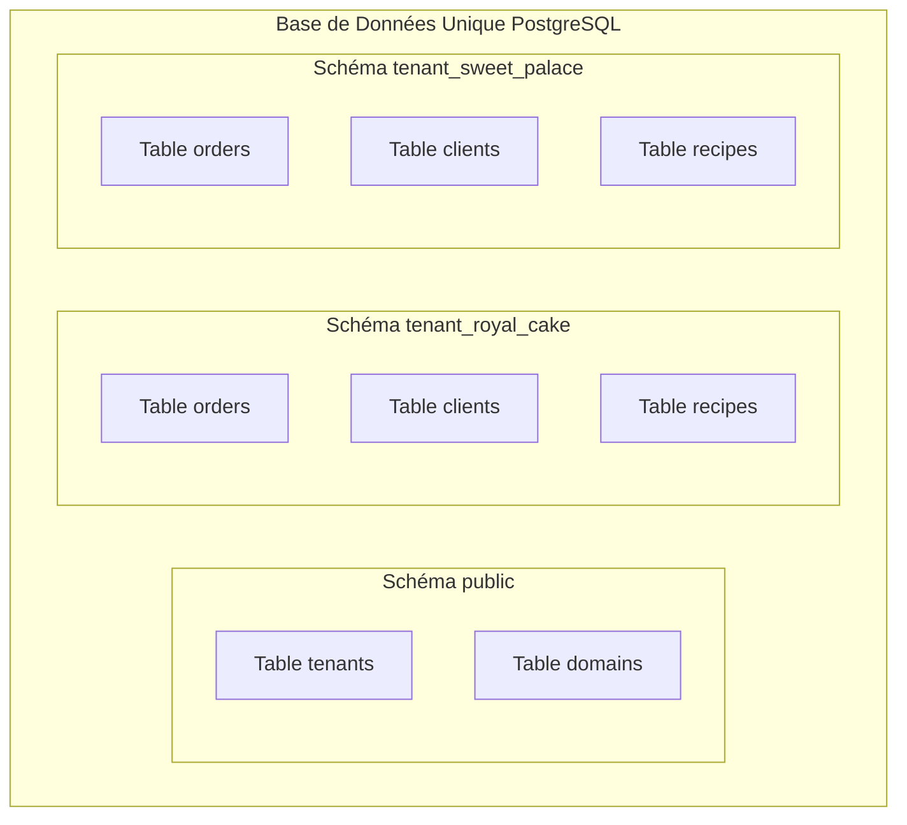
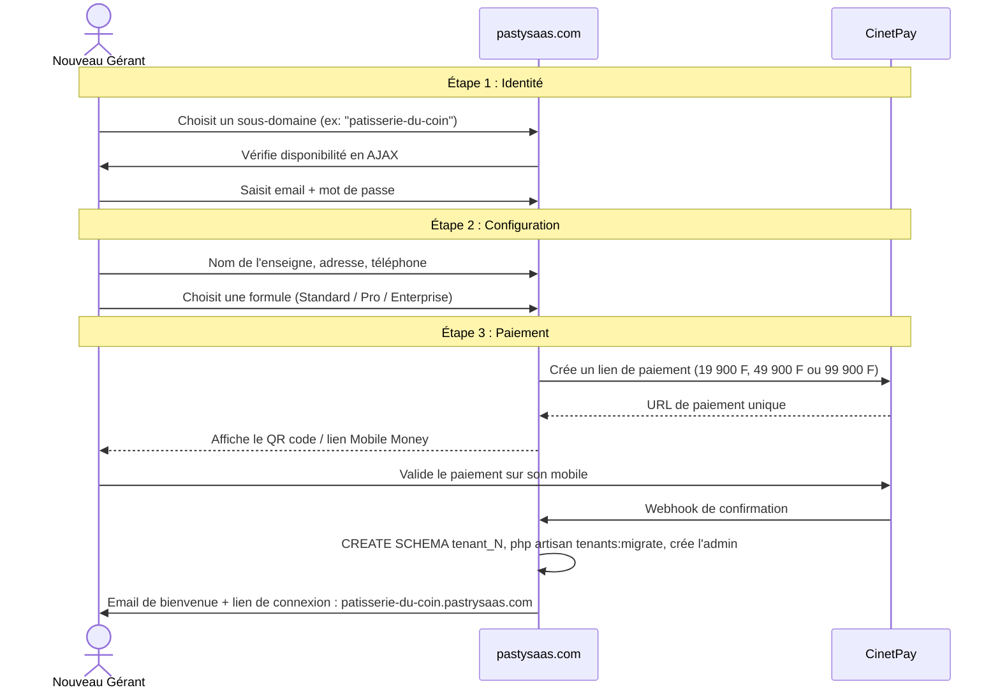
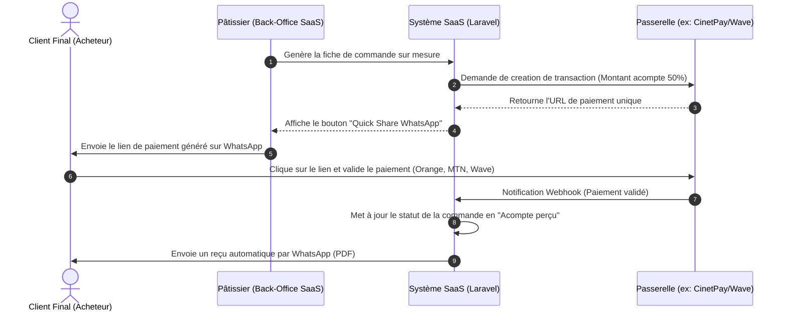

# Document d'Architecture : Transformation en SaaS Multi-Tenant
## Projet : Application de Gestion pour Pâtisserie sur Mesure

Ce document évalue la faisabilité technique de la transformation de l'application de gestion de pâtisserie (Laravel 13, Livewire 4, Flux UI, PostgreSQL) en une plateforme SaaS (Software as a Service) en utilisant l'architecture de **séparation par Schémas PostgreSQL** et des **intégrations Mobile Money** adaptées au marché ivoirien (UEMOA).

---

## 1. Choix de l'Architecture : PostgreSQL Schemas (Schéma par Tenant)

L'utilisation de **Schémas PostgreSQL** est un excellent compromis entre la base de données unique partagée (Single-DB) et la base de données dédiée (Multi-DB). 

Dans ce modèle :
*   **Base centrale :** Le schéma par défaut `public` contient les tables globales (`tenants`, `domains`, `subscriptions`, etc.).
*   **Bases locataires :** Chaque nouvelle pâtisserie possède son propre schéma au sein de la même base PostgreSQL (ex: `tenant_royal_cake`, `tenant_delices_de_paris`).
*   **Isolation :** L'isolation est assurée au niveau SQL en modifiant le chemin de recherche PostgreSQL (`search_path`).



### Avantages et Inconvénients de l'approche par Schémas

| Avantages | Inconvénients |
| :--- | :--- |
| **Sécurité robuste :** Pas de risque de fuite de données par oubli de clause `WHERE tenant_id`. Une requête `SELECT * FROM orders` ne retournera que les données du schéma actif. | **Ressources partagées :** Tous les locataires partagent le même processeur, la même mémoire RAM et le même disque dur PostgreSQL. |
| **Simplicité d'hébergement :** Une seule base de données à gérer, sauvegarder et maintenir. Pas besoin de provisionner de nouveaux serveurs ou ports. | **Limites théoriques :** PostgreSQL gère très bien des milliers de schémas, mais au-delà de 10 000 schémas avec des centaines de tables, les performances du catalogue système peuvent ralentir. |
| **Migrations propres :** Vos requêtes et structures de tables existantes n'ont pas besoin d'être modifiées (pas de colonne `tenant_id` à rajouter partout). | **Sauvegardes partielles :** Bien que possible (`pg_dump -n schema_name`), restaurer le schéma d'un seul client peut être plus fastidieux qu'une base dédiée. |
| **Création instantanée :** La commande `CREATE SCHEMA tenant_x` est quasi instantanée à l'inscription d'un client. | |

---

## 2. Modélisation des Tables Globales (Schéma `public`)

Toutes les tables du schema `public` utilisent des **clés primaires INTEGER** pour rester cohérent avec le code existant et simplifier les migrations.

```mermaid
erDiagram
    TENANT ||--o{ DOMAIN : "associe_a"
    TENANT ||--o{ SUBSCRIPTION : "a"
    TENANT ||--|| PLAN : "souscrit_a"
    PLAN ||--o{ TENANT : "utilise"
    PLAN ||--o{ PLAN_FEATURE : "definit"
    TENANT {
        int id PK
        string name "Nom de la Pâtisserie"
        string slug "Identifiant sous-domaine (ex: royal-cake)"
        string schema_name "Nom du schema Postgres (ex: tenant_1)"
        int plan_id FK
        string status "active, suspended, trial, expired"
        timestamp trial_ends_at
        timestamp subscription_ends_at
        jsonb preferences "Configuration specifique"
        timestamps created_at_updated_at
    }
    DOMAIN {
        int id PK
        int tenant_id FK
        string domain "Ex: app.royal-cake.com"
        boolean is_primary
    }
    PLAN {
        int id PK
        string name "Standard, Pro, Enterprise"
        string slug "standard, pro, enterprise"
        int price_monthly "Prix mensuel en FCFA"
        int price_yearly "Prix annuel en FCFA"
        boolean is_public
        timestamps
    }
    PLAN_FEATURE {
        int id PK
        int plan_id FK
        string feature_key "max_recipes, stock_management, ..."
        string value "nombre ou boolean"
    }
    SUBSCRIPTION {
        int id PK
        int tenant_id FK
        int plan_id FK
        string status "active, cancelled, expired"
        string gateway "cinetpay, paystack"
        string gateway_subscription_id
        timestamp starts_at
        timestamp ends_at
        timestamps
    }
    COUPON {
        int id PK
        string code
        int discount_percent
        int max_uses
        int used_count
        timestamp expires_at
        timestamps
    }
```

### Règle de nommage des schémas

Les noms de schémas sont **numériques** (`tenant_1`, `tenant_2`, ...) plutôt que descriptifs (`tenant_royal_cake`) pour éviter les problèmes de caractères spéciaux (apostrophes, accents, espaces). La correspondance se fait via la table `tenants.slug` et `tenants.schema_name`.

---

## 3. Flux d'Exécution & Initialisation du Schéma

Lorsqu'une requête HTTP arrive sur l'application (ex: `https://royal-cake.pastrysaas.com/admin/orders`) :

1.  Le middleware d'identification du locataire extrait le sous-domaine `royal-cake`.
2.  L'application interroge la table `public.tenants` pour récupérer le `schema_name` (ici `tenant_1`).
3.  Laravel exécute la commande PostgreSQL suivante pour cette connexion :
    ```sql
    SET search_path TO tenant_1, public;
    ```
4.  Dès cet instant, toutes les requêtes Eloquent (comme `Order::all()`) s'exécutent par défaut dans le schéma `tenant_1`. Si une table n'existe pas dans ce schéma, PostgreSQL cherche dans le schéma `public`.
5.  Le middleware `InitializeTenant` est exécuté **avant** `StartSession` et `Authenticate` pour que l'auth et les sessions utilisent le bon schema.

### Gestion du contexte dans les jobs asynchrones

Les jobs (Horizon, files d'attente) doivent transporter le `tenant_id` dans leurs payloads. Le job restaure le `search_path` avant d'exécuter la logique métier :

```php
trait RestoreTenantContext
{
    public int $tenantId;

    public function handle(): void
    {
        $tenant = Tenant::findOrFail($this->tenantId);
        DB::statement("SET search_path TO {$tenant->schema_name}, public");
        // ... logique métier ...
    }
}
```

---

## 4. Configuration Recommandée du Stack Technique

### A. Intégration dans Laravel avec `stancl/tenancy`

Le package [`stancl/tenancy`](https://tenancyforlaravel.com/) est le plus mature de l'écosystème Laravel pour le multi-tenant. Il supporte nativement les schémas PostgreSQL via le bootstrapper `DatabaseTenancyBootstrapper` :

```php
// config/tenancy.php
'bootstrappers' => [
    Stancl\Tenancy\Bootstrappers\DatabaseTenancyBootstrapper::class,
    Stancl\Tenancy\Bootstrappers\CacheTenancyBootstrapper::class,
    Stancl\Tenancy\Bootstrappers\FilesystemTenancyBootstrapper::class,
    Stancl\Tenancy\Bootstrappers\QueueTenancyBootstrapper::class,
],

'database' => [
    'central_connection' => 'pgsql',
    'template_tenant_connection' => 'tenant',
],
```

Le package gère :
- La résolution du tenant par sous-domaine ou domaine personnalisé
- L'isolation du cache (préfixe par tenant)
- L'isolation des fichiers (répertoire par tenant)
- Le contexte des jobs asynchrones
- La création et migration automatique des schemas à l'inscription

### B. Gestion des Migrations
Les migrations de l'application devront être organisées ainsi :
*   `database/migrations/` : Tables globales (ex: `tenants`, `domains`, `plans`).
*   `database/migrations/tenant/` : Tables métiers existantes (ex: `orders`, `clients`, `recipes`, etc.).

### C. Stratégie de migration des données existantes

L'application actuelle a toutes ses données dans `public`. Voici comment les basculer :

```
┌─────────────────────────────────────────────────────┐
│                    PostgreSQL                        │
│  ┌─────────┐   ┌──────────────────────────────────┐ │
│  │ public  │   │  tenant_1 (NOUVEAU)              │ │
│  │ ─────── │   │  ───────────                     │ │
│  │ tenants │   │  clients  ← copier depuis public │ │
│  │ plans   │   │  orders   ← copier depuis public │ │
│  │ domaines│   │  stock    ← copier depuis public │ │
│  │ ─────── │   │  ...                             │ │
│  │ sessions│   └──────────────────────────────────┘ │
│  │ cache   │                                         │
│  │ jobs    │                                         │
│  │ ─────── │                                         │
│  │ ⚠ clients│ (supprimées après migration)           │
│  │ ⚠ orders │ (supprimées après migration)           │
│  │ ⚠ stock │                                         │
│  └─────────┘                                         │
└─────────────────────────────────────────────────────┘
```

Étapes :
1. Installer `stancl/tenancy`, créer la table `tenants`, insérer le premier tenant
2. Lancer une commande Artisan `tenant:migrate-data tenant_1` qui copie chaque table métier de `public` vers `tenant_1` avec `CREATE TABLE tenant_1.x AS TABLE public.x INCLUDING ALL`
3. Vérifier les comptages (row count) et les séquences
4. Activer le middleware `InitializeTenant`
5. Tester en local avec le sous-domaine
6. Une fois validé, supprimer les tables métier de `public` (`DROP TABLE public.clients, public.orders, ... CASCADE`)

---

## 5. Restriction de Fonctionnalités par Plan (Feature Gates)

Chaque plan définit un ensemble de limites et de droits. Les vérifications se font côté serveur (pas seulement côté UI).

### Architecture des vérifications

```php
// app/Enums/PlanFeature.php
enum PlanFeature: string
{
    case MAX_RECIPES = 'max_recipes';
    case MAX_ORDERS_MONTHLY = 'max_orders_monthly';
    case MAX_EMPLOYEES = 'max_employees';
    case STOCK_MANAGEMENT = 'stock_management';
    case PRODUCTION_CALENDAR = 'production_calendar';
    case STORAGE_GB = 'storage_gb';
    case EXPORT_CSV = 'export_csv';
    case API_ACCESS = 'api_access';
    case SUPPORT_LEVEL = 'support_level'; // 'email', 'priority', 'dedicated'
}
```

### Grille de plans proposée

| Fonctionnalité | Standard (19 900 F/mois) | Pro (49 900 F/mois) | Enterprise (99 900 F/mois) |
|---|---|---|---|
| Commandes actives / mois | 50 | Illimité | Illimité |
| Fiches techniques (recettes) | 20 | Illimité | Illimité |
| Employés | 3 | 10 | Illimité |
| Gestion de stock avancée | ❌ Base (alertes) | ✅ Complet | ✅ Complet |
| Planning atelier | ❌ | ✅ | ✅ |
| Export CSV | ❌ | ✅ | ✅ |
| Support | Email | Prioritaire | Dédié + WhatsApp |
| API | ❌ | ❌ | ✅ |
| Espace disque | 1 Go | 5 Go | 20 Go |

### Implémentation des vérifications

```php
// App\Models\Tenant
public function featureValue(PlanFeature $feature): mixed
{
    return $this->plan->features[$feature->value] ?? null;
}

public function canUse(string $feature): bool
{
    return (bool) $this->featureValue($feature);
}
```

```php
// Middleware ou helper global utilisé dans les composants Livewire
// Exemple : vérifier limite mensuelle de commandes
public function canCreateOrder(): bool
{
    $tenant = app(Tenant::class);
    $max = $tenant->featureValue(PlanFeature::MAX_ORDERS_MONTHLY);
    
    if ($max === null) return true; // Illimité
    
    $count = Order::whereMonth('created_at', now()->month)
        ->whereYear('created_at', now()->year)
        ->count();
    
    return $count < (int) $max;
}
```

### Comportement en cas de dépassement

- **Création bloquée** avec un message clair : *"Vous avez atteint la limite de {X} commandes de votre forfait Standard. Passez au forfait Pro pour bénéficier d'un accès illimité."*
- **Bouton d'upgrade** directement dans le message d'erreur
- **Compteurs visibles** dans l'interface (ex: "3/10 employés utilisés")

---

## 6. Super-Admin Dashboard

Espace d'administration globale, accessible via un sous-domaine dédié (`super-admin.pastrysaas.com`) ou un prefixe de route sans middleware tenant. L'utilisateur super-admin vit dans `public.users` (pas dans un schema tenant).

### Routes

```php
// routes/super-admin.php
Route::prefix('super-admin')->middleware(['auth', 'role:super-admin'])->group(function () {
    Route::get('/', SuperAdminDashboard::class);               // Vue d'ensemble
    Route::get('/tenants', TenantIndex::class);                // Liste des tenants
    Route::get('/tenants/{tenant}', TenantShow::class);        // Détail d'un tenant
    Route::post('/tenants/{tenant}/suspend', ...);             // Suspendre
    Route::post('/tenants/{tenant}/activate', ...);            // Réactiver
    Route::get('/plans', PlanIndex::class);                    // Gestion des plans
    Route::get('/coupons', CouponIndex::class);                // Coupons de réduction
    Route::get('/logs', ActivityLogIndex::class);              // Audit global
});
```

### Métriques clés du tableau de bord

| Métrique | Requête | Filtre temporel |
|---|---|---|
| **MRR** (Monthly Recurring Revenue) | `SUM(plans.price_monthly) WHERE tenants.status = 'active'` | Mois courant |
| **Tenants actifs** | `COUNT(*) WHERE status = 'active'` | Temps réel |
| **Tenants en essai** | `COUNT(*) WHERE status = 'trial'` | Temps réel |
| **Tenants suspendus** | `COUNT(*) WHERE status = 'suspended'` | Temps réel |
| **Nouveaux tenants (30j)** | `COUNT(*) WHERE created_at > now() - 30 days` | Glissant |
| **Désabonnements (30j)** | `COUNT(*) WHERE status = 'expired' AND subscription_ends_at > now() - 30 days` | Glissant |
| **Churn rate** | `desabonnements / actifs * 100` | Mensuel |

### Actions disponibles

- **Suspendre/Réactiver** un tenant (passe `is_active = false` sur le tenant + tous ses users)
- **Impersonifier** un tenant (se connecter en tant que gérant pour le support)
- **Modifier le plan** d'un tenant (upgrade/downgrade forcé)
- **Créer des coupons** de réduction (code, %, durée, utilisations max)
- **Voir les logs** d'activité globaux (connexions, actions critiques)

---

## 7. Portail d'Inscription (Onboarding en 3 étapes)

Le portail est hébergé sur le domaine racine (`pastrysaas.com`) sans middleware tenant. L'utilisateur potentiel s'inscrit et une fois le paiement validé, son schema tenant est créé.

### Flow utilisateur



### Détail technique de l'étape 3 (post-paiement)

```php
// App\Livewire\Onboarding\CompleteRegistration.php
public function handlePaymentWebhook(array $payload): void
{
    DB::transaction(function () use ($payload) {
        // 1. Créer le tenant
        $tenant = Tenant::create([
            'name' => session('onboarding.company_name'),
            'slug' => session('onboarding.subdomain'),
            'schema_name' => 'tenant_' . (Tenant::max('id') + 1),
            'plan_id' => session('onboarding.plan_id'),
            'status' => 'active',
            'subscription_ends_at' => now()->addMonth(),
        ]);

        // 2. Créer le schema PostgreSQL
        DB::statement("CREATE SCHEMA {$tenant->schema_name}");

        // 3. Migrer le schema
        DB::statement("SET search_path TO {$tenant->schema_name}, public");
        Artisan::call('migrate', ['--path' => 'database/migrations/tenant', '--force' => true]);

        // 4. Créer l'utilisateur admin
        $user = User::create([
            'name' => session('onboarding.gerant_name'),
            'email' => session('onboarding.email'),
            'password' => bcrypt(session('onboarding.password')),
            'is_active' => true,
        ]);
        $user->assignRole('Gérant/Admin');

        // 5. Enregistrer l'abonnement
        Subscription::create([
            'tenant_id' => $tenant->id,
            'plan_id' => $tenant->plan_id,
            'status' => 'active',
            'gateway' => 'cinetpay',
            'gateway_subscription_id' => $payload['transaction_id'],
            'starts_at' => now(),
            'ends_at' => now()->addMonth(),
        ]);

        // 6. Nettoyer la session
        session()->forget('onboarding.*');
    });
}
```

### Vérification disponibilité sous-domaine (temps réel)

```php
// Dans le composant Livewire de l'étape 1
public $subdomain = '';

public function updatedSubdomain(): void
{
    $this->validateOnly('subdomain', ['subdomain' => 'required|alpha_dash|min:3|max:30']);
    
    $this->subdomainAvailable = !Tenant::where('slug', $this->subdomain)->exists();
}
```

---

## 8. Synthèse des Évolutions de la Base de Données pour les Paiements

Dans le contexte ivoirien, le paiement par carte bancaire est marginal par rapport aux transferts mobiles. Nous devons gérer deux types de flux financiers.

### A. Passerelles de Paiement Recommandées

1.  **CinetPay (Recommandé - Basé à Abidjan) :**
    *   **Moyens supportés :** Orange Money, MTN MoMo, Moov Money, Wave, et cartes bancaires.
    *   **Devise :** FCFA (XOF).
    *   **Avantage :** Intégration locale historique, agréments BCEAO, support de Wave en Côte d'Ivoire.
2.  **Paystack (Alternative de confiance) :**
    *   **Moyens supportés :** MTN MoMo, Orange Money, Wave, cartes bancaires.
    *   **Avantage :** API moderne (type Stripe), racheté par Stripe, excellente documentation, gestion des remboursements simplifiée.

---

### B. Flux 1 : Abonnement des Pâtisseries au SaaS (B2B)

Le prélèvement automatique récurrent (Direct Debit) sur Mobile Money est difficile à mettre en place et peu apprécié des utilisateurs en Côte d'Ivoire.

#### Modèle d'abonnement recommandé : **Le Renouvellement Manuel Prépayé**
Au lieu d'un abonnement à prélèvement automatique, nous mettons en place un système de facturation par cycle :
1.  **Notification :** 5 jours avant l'expiration, l'application affiche une alerte in-app et envoie un rappel par e-mail/WhatsApp.
2.  **Lien de paiement :** Un bouton "Renouveler mon abonnement" génère un lien de paiement via **CinetPay** ou **Paystack**.
3.  **Validation :** Le gérant de la pâtisserie saisit son numéro de téléphone, valide l'invite USSD push sur son mobile et paie.
4.  **Activation :** Le Webhook de la passerelle de paiement confirme la transaction à la base centrale, ce qui prolonge le champ `subscription_ends_at` du locataire dans le schéma `public`.
5.  **Suspension :** Si aucun paiement n'est validé à la date d'expiration, le statut passe à `suspended`, redirigeant le sous-domaine vers une page de renouvellement.

---

### C. Flux 2 : Paiement des Acomptes par les Clients des Pâtisseries (B2C)

Conformément à la gestion des commandes sur mesure négociées sur WhatsApp :



#### Sous-comptes (Sub-accounts / Splits) :
Dans un modèle SaaS standard, la passerelle doit savoir comment répartir l'argent :
*   **Option 1 : Compte unique de la plateforme (Le plus simple au début)**
    Tout l'argent des clients arrive sur le compte de votre plateforme SaaS. Vous reversez ensuite les gains aux pâtisseries (par virement ou virement Wave/MoMo groupé) après déduction de vos frais.
*   **Option 2 : Intégration des clés du client (Recommandée)**
    Chaque pâtisserie saisit ses propres identifiants API (CinetPay/Paystack) dans ses paramètres de boutique. L'argent de ses clients va directement sur son compte Mobile Money pro, sans transiter par votre entreprise.

---

## 9. Synthèse des Évolutions de la Base de Données pour les Paiements

Dans chaque schéma locataire (`tenant_*`), nous devons ajuster la table `transactions` pour gérer les informations de passerelle :

```sql
ALTER TABLE transactions 
ADD COLUMN gateway_transaction_id VARCHAR(255) NULL, -- ID fourni par CinetPay/Paystack
ADD COLUMN payment_method VARCHAR(50) NULL,        -- 'orange_money', 'mtn_momo', 'wave', 'card'
ADD COLUMN checkout_url TEXT NULL;                  -- Lien de paiement généré pour WhatsApp
```
